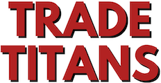

<p align='center'>
  
</p>

<p align='center'>
  <a href='https://trade-titans.vercel.app/'><strong>Live demo →</strong></a>
</p>

## About

Trade Titans is a fantasy football trade analyzer. Pick players for each side of a proposed trade, and the app shows you the total value for each team and whether the trade is fair or lopsided. It's built for league managers who want a quick gut-check before accepting or countering a trade offer.

## Features

- Side-by-side trade builder with search and value-sorted suggestions
- Live totals and a fair-trade verdict (within 2 points = fair) as you add or remove players
- Responsive layout that works on phones and desktops
- Rosters synced from the free [Sleeper API](https://docs.sleeper.com/); trade values curated in a committed JSON file

## Tech Stack

- [Next.js 13](https://nextjs.org/) (App Router) with TypeScript
- [React 18](https://react.dev/)
- [Prisma](https://www.prisma.io/) ORM against [Vercel Postgres](https://vercel.com/storage/postgres)
- [Tailwind CSS](https://tailwindcss.com/) for styling
- Deployed on [Vercel](https://vercel.com/)

## Data

Player rosters come from the public Sleeper API at build/seed time — no API key required. Trade values live in `prisma/data/player-values.json` and cover the top ~200 fantasy-relevant players. Re-running `npm run db:seed` refreshes teams/positions from Sleeper while keeping curated values intact.

## Running Locally

You'll need Node 22+ and a Postgres database (a free Vercel Postgres instance works).

```bash
# 1. Install deps
npm install

# 2. Configure env — copy from your Vercel Postgres dashboard
cp .env.example .env
# DATABASE_URL=postgres://...
# POSTGRES_URL=postgres://...
# (plus the other POSTGRES_* vars Vercel provides)

# 3. Set up the schema + seed the DB
npx prisma migrate dev
npm run db:seed

# 4. Run it
npm run dev
```

Open [http://localhost:3000](http://localhost:3000).

## Why I Built It

I've been playing fantasy football for years and kept pasting trade offers into three different calculators to see if they were fair. I wanted one that felt fast, had a clean UI, and would let me show off a Next.js + Prisma + Vercel Postgres stack in a single portfolio project.
